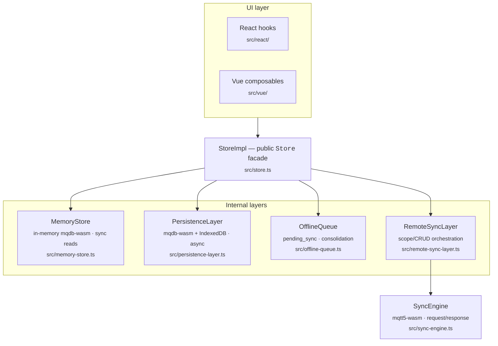
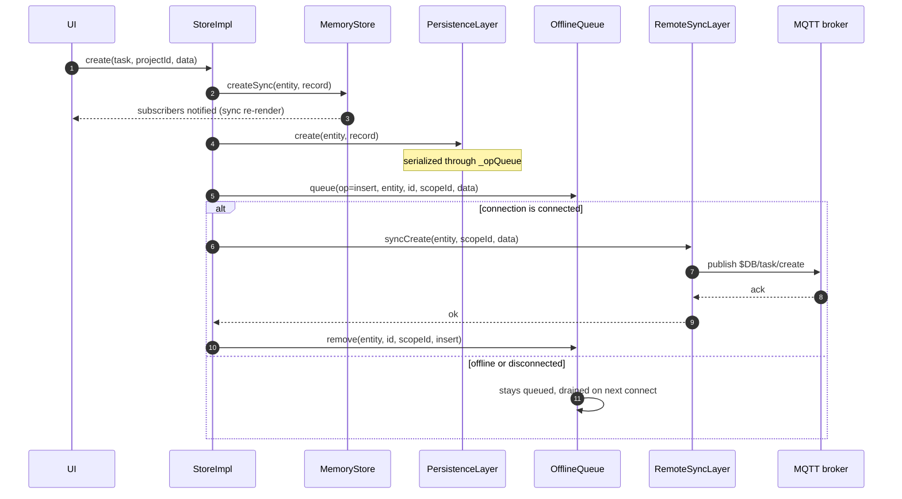
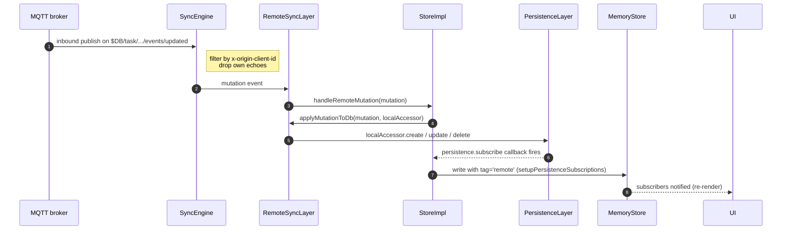
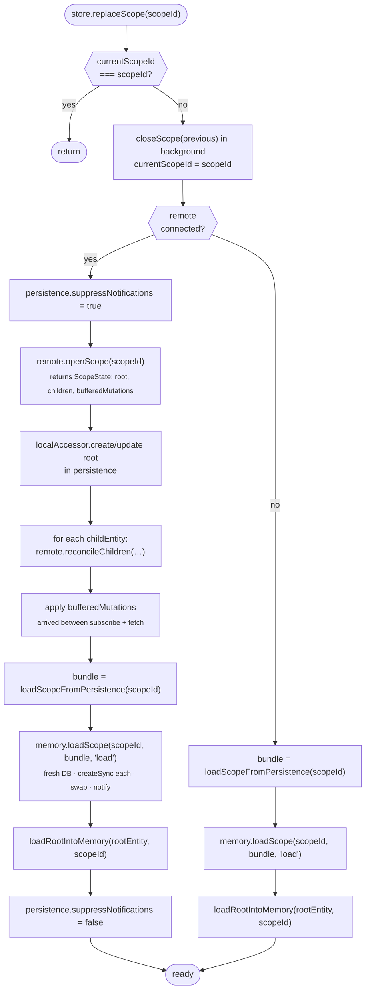
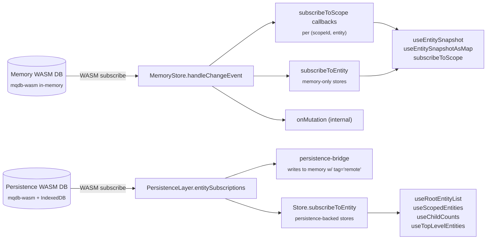
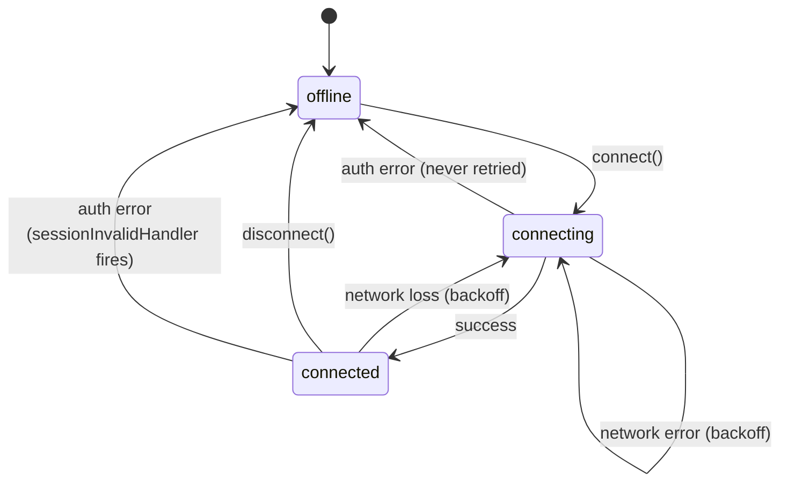

# Architecture

This document describes the internal design of `@laboverwire/stitch` — how layers compose, how data flows, and the invariants each layer depends on. If you're adding a feature or tracking down a bug that crosses layer boundaries, start here.

For the public API surface, see [README.md](./README.md). For a history of changes and 0.1 → 0.2 migration notes, see [CHANGELOG.md](./CHANGELOG.md).

---

## What the library is

Stitch is a reactive state-sync library for browser apps that need:

1. **Synchronous reads for the UI** — the render loop can call `store.read(...)` / `store.getSnapshot(...)` and get data back without awaiting.
2. **Durable local state** — IndexedDB survives reloads, offline sessions, and reconnect storms.
3. **Live multi-device sync** — changes propagate over MQTT and reconcile with other clients.
4. **Offline tolerance** — mutations queue locally and drain when connected.

The central trick is that "source of truth for the UI" and "source of truth for durability" are different concerns, handled by different WASM databases. A synchronous in-memory `mqdb-wasm` DB services reads; an async `mqdb-wasm` IndexedDB-backed DB owns persistence; the MQTT layer is purely about moving mutations between clients.

---

## Layer stack



Two independent mqdb-wasm `Database` instances live inside a store:

- The **memory DB** (`MemoryStore._db`) holds only the currently active scope. Synchronous API (`createSync`, `listSync`, `readSync`). Rebuilt on every `replaceScope` call.
- The **persistence DB** (`PersistenceLayer.db`) holds everything ever stored locally. Async API. Survives page reloads via IndexedDB.

`persistence-store.ts` and `persistence-bridge.ts` are the pre-0.2 monolith and are `@deprecated`. New code should not reach for them.

---

## Module map

| File | Role |
|---|---|
| `types.ts` | All public type exports. `Store`, `StoreConfig`, `StoreOptions`, `EntitySchema`, plus the internal `MemoryStore` / `PersistenceLayer` / `RemoteSyncLayer` / `OfflineQueue` / `SyncEngine` interfaces. |
| `store.ts` | `StoreImpl` — the public facade. Composes all layers. Owns the init promise cache, scope-lifecycle routing, and CRUD fan-out. `createStore()` returns this. |
| `memory-store.ts` | `MemoryStoreImpl` — in-memory WASM DB, sync reads, scope-indexed subscriptions, batch-notify support. Holds the `_Database` constructor reference so `loadScope` can swap instances. |
| `persistence-layer.ts` | `PersistenceLayerImpl` — IndexedDB-backed WASM DB with a serialized op queue, corruption recovery, and an entity-subscription bus that bridges WASM events into plain JS callbacks. |
| `remote-sync-layer.ts` | `RemoteSyncLayerImpl` — translates scope/CRUD operations into MQTT topic requests and routes inbound mutations back to the store. Owns reconcile + initial-sync logic. |
| `sync-engine.ts` | Low-level MQTT5 client wrapper. Topic subscription, request-response with correlation IDs, enhanced auth flow for JWT tickets, backoff strategy. Framework-agnostic — takes the WASM module as an argument. |
| `offline-queue.ts` | Two implementations: `createPersistentOfflineQueue` (writes to `pending_sync`) and `createInMemoryOfflineQueue`. Consolidation logic: collapses insert+updates, insert+delete, stacked updates before flushing. |
| `internal-utils.ts` | `stripNulls`, `isTransientSyncError`. Canonical utilities — an older `stripNulls` copy still exists in `memory-store.ts`. |
| `internal-wasm-error.ts` | `MqdbError` and `wrapWasmError` — used at every WASM call site. |
| `react/` | React bindings. `context.ts` + `provider.tsx` + `hooks/*`. |
| `vue/` | Vue 3 bindings. `injection-key.ts` + `StoreRoot.ts` + `StitchAuth.ts` + `composables/*`. |

---

## Core abstractions

### Scope

A **scope** is a single instance of the root entity. The root entity's `id` **is** the `scopeId`.

- The `StoreConfig.scope` block declares which entity is the root (`rootEntity`), which entities belong under it (`childEntities`), and which field on the children points at the root (`scopeField`).
- `replaceScope(scopeId)` loads that scope's bundle from persistence (and the server, if connected), populates the memory DB, and starts streaming live mutations for it. Any previously-active scope is replaced wholesale.
- `closeScope(scopeId)` unsubscribes the MQTT topics for that scope and clears the in-memory data.

Only one scope is live at a time in the memory DB. This keeps the memory WASM instance small and the sync boundaries predictable, at the cost of requiring a scope switch to rebuild in-memory state.

### Origin tag

Every mutation carries an `originTag: string | null` that controls which layers act on it. The tag is set on `MemoryStoreImpl.originTag` before a sync-WASM call and read back by the subscription callback that fires.

| Tag | Meaning |
|---|---|
| `null` / `undefined` | Local user mutation — propagate to persistence and remote. |
| `'remote'` | Inbound from MQTT — write to memory, skip persistence (already written). Prevents echo loops. |
| `'load'` | From `replaceScope` / `loadScope` — populate memory silently, don't persist. |
| `'clear'` | Scope teardown — don't fire CRUD side effects. |

The `persistence-bridge` and `PersistenceLayer` subscription callbacks check `originTag` and short-circuit when appropriate to prevent write amplification.

### Entity schema types

`types.ts` exports `EntitySchema = Record<string, object>` and `EntityKey<S>`. `createStore<Schema>(...)` returns a `Store<Schema>` whose `read` / `getSnapshot` / `create` / `update` / `delete` / `subscribeToEntity` / `subscribeToScope` / `list` are all typed via `S[EntityKey<S>]`.

`listRootEntities` stays untyped (`Record<string, unknown>[]`) because the root-entity type name isn't statically inferable from `StoreConfig`; callers typically cast. This is an intentional simplification — encoding the root entity as a separate generic parameter would require `Store<S, R>` everywhere and pollute every hook signature.

---

## Data flow

### Local mutation (create / update / delete)



Error branches on the outbound sync:
- `OwnershipError` (403) — remove from queue, swallow (never retried).
- Transient (timeout / disconnected / FK violation) — leave queued, retry on next flush.
- `"not found"` on update — upsert: treat as create on remote.

UI re-renders happen off the memory-store subscription. Persistence writes are non-blocking for the UI.

### Remote mutation (inbound MQTT)



Round trip: inbound MQTT → persistence write → persistence WASM event → `StoreImpl.setupPersistenceSubscriptions` relays into memory → UI. The `'remote'` origin tag prevents the memory-side write from looping back out through the offline queue.

### Scope replacement



`memory.loadScope` is destructive by design — it constructs a fresh `new Database()`, registers schemas, `createSync`s each loaded record, then swaps `_db`. Old subscribers are still attached to the new DB via `setupSubscriptions()`. After the swap, each entity's subscribers are explicitly notified so consumers re-read their snapshots.

---

## Subscription machinery

Three layers publish events; the framework hooks consume from the memory layer.



Key contract: `Store.subscribeToEntity(entity, cb)` bridges both sources — when persistence is configured, `persistence.subscribe` carries normal create/update/delete events while `memory.onMutation` is kept attached but filtered to deliver only `'load'` and `'clear'` tags (which bypass the persistence bridge). Without persistence it falls back to `memory.onMutation` alone. The early-subscriber migration in `initialize()` rebinds pre-init subscribers onto persistence once it opens while keeping the memory hook alive so `replaceScope` loads still fire.

### Memory-store subscriptions

`MemoryStore.setupSubscriptions()` iterates `this.allEntities` (which includes the root plus child + top-level entities) and attaches a single WASM subscription per entity:

```
db.subscribe('#', entity, event => handleChangeEvent(entity, event))
```

`handleChangeEvent` derives the `scopeId` (from `data[scopeField]` for children, from `event.id` for the root), bumps a per-(scope, entity) version counter, and calls:

- `notifySubscribers(scopeId, entity)` → per-scope subscribers (`subscribeToScope`) and global subscribers (`subscribeToEntity`)
- `emitMutation(event)` → raw `onMutation` listeners (internal; `Store.onMutation` is not public)

Batching: `beginBatch()`/`endBatch()` defer notification. The batched set is keyed `scopeId\0entity` and flushed in `endBatch`. `loadScope` notifies synchronously without using the batch because the batch would be empty (batched entries are populated only by the WASM subscription callback).

### Persistence-layer subscriptions

`PersistenceLayer.subscribe(entity, cb)` attaches to `entitySubscriptions`, a plain JS `Map<entity, Set<callback>>`. One WASM subscription per entity (in `setupWasmSubscriptions`) fan-outs to all registered JS callbacks.

`notifyAllEntitySubscribers()` is called at the end of `store.initialize` and again at the end of `onConnected` after the initial remote sync resolves. It fires `(data: null, op: 'update')` to every entity's callbacks so late-joined subscribers can hydrate and hooks relying on `listRootEntities` (which returns `[]` until `initialSyncDone`) refresh once the broker's state has landed. Consumers interpret `data === null` as "bulk refresh, re-fetch".

`setSuppressNotifications(true)` silences the WASM → JS fan-out during `replaceScope`'s reconcile window. Any events during reconcile are swallowed; the explicit `memory.loadScope` notification at the end is the source of truth.

### `Store.subscribeToEntity` — the unified surface

```ts
store.subscribeToEntity(entity, (data: Record<string, unknown> | null, op) => { ... })
```

- When persistence is configured, attaches to both `persistence.subscribe(entity, cb)` (carries every persisted mutation) and `memory.onMutation` (filtered to `'load'` and `'clear'` origin tags — the two tags that bypass persistence). This preserves `replaceScope` coverage without double-firing for normal local or remote mutations.
- When no persistence, listens on `memory.onMutation` alone and filters by entity name.
- Before initialize (`_persistence === null`), registers an "early subscriber" (`_earlySubscribers` array) that is migrated onto the persistence layer once it opens; the memory hook remains attached through the migration.

Data is forwarded with a coerced `null` when the underlying callback signals a bulk-refresh. Ops are `'insert' | 'update' | 'delete'` normalized from whichever source fired.

### `Store.subscribeToScope`

Simpler: delegates to `memory.subscribeToScope(scopeId, entity, cb)`. Callback is `() => void` — it only signals "something in this scope's entity set changed"; consumers re-read the snapshot.

---

## Concurrency & serialization

### `PersistenceLayer._opQueue`

Every async DB operation is threaded through `serialized(label, fn, timeoutMs=10000)`:

```ts
this._opQueue = this._opQueue.then(async () => {
  await new Promise(r => setTimeout(r, 0));
  if (this._dbNeedsRecovery) await this.recoverDb();
  return Promise.race([fn(), timeoutGuard]);
});
```

This guarantees only one DB op is in flight at a time. The 10s timeout flags the DB for recovery on the next serialized call — `recoverDb()` re-opens the IndexedDB connection, re-registers schemas, and re-attaches WASM subscriptions before the next op runs.

### `StoreImpl._initPromise`

`store.initialize()` is idempotent. The first caller kicks off `doInitialize()` and stores the resulting promise on `_initPromise`. Subsequent concurrent callers (React `<StrictMode>` double-invoke, nested providers) await the same promise instead of constructing a second persistence layer that would orphan already-migrated subscribers. On success the cache is cleared; on failure the cache is also cleared so a retry can run.

### Memory-store origin tags

`originTag` is a class field mutated around a single sync WASM call:

```ts
this.originTag = tag ?? null;
this.db.createSync(entity, record);   // WASM event fires; callback reads this.originTag
this.originTag = null;
```

This works because `createSync` is synchronous — the WASM event and its handler run before the next line executes. If the library ever adopts async variants internally, the tag machinery needs to move to an argument-threaded pattern.

---

## Offline queue

Any local mutation that has a `scopeId` gets queued in `pending_sync` (or in memory, when no persistence is configured). The queue is only drained when the remote layer reports `connected`.

### Consolidation

Before flushing, `OfflineQueue.flush()` groups pending rows by (entity, entityId) and collapses them:

- **Insert + N updates** → single insert with merged fields (last write wins).
- **Insert + delete** → just a delete... actually: dropped entirely (the record never made it to the server, no-op).
- **N updates** → single update with merged fields.
- **Update + delete** → delete only.

This keeps the wire protocol bounded regardless of how long the client was offline. Order across entities is preserved by `createdAt`, then by op priority (`insert=0, update=1, delete=2`) to respect FK constraints on replay.

### Double flush on connect

`StoreImpl.onConnected()` calls `flush(sender)` twice:

1. First flush replays consolidated mutations. Some will hit "not found" on the server (e.g., updates to records whose insert hasn't been acknowledged yet) and emit upsert compensations.
2. Second flush drains those compensations.

### Ownership errors

`OwnershipError` (a 403 from the server — the client doesn't own the record it's trying to mutate) is treated specially: the pending row is removed and the error is **swallowed**, not retried. This prevents infinite loops when authorization changes mid-flight.

---

## Reconciliation

On `replaceScope` (with remote connected) or on `onConnected`, the local state and server state are compared:

- **Server record absent locally** → write to persistence via `localAccessor.create`.
- **Server record present locally, same version** → skip.
- **Server record present locally, server version newer** → overwrite.
- **Server record present locally with a pending insert in the queue** → keep local (server will receive it on flush).
- **Local record not on server** → delete locally (unless there's a pending insert).

Version comparison uses the `versionField` (numeric, monotonic) plus `updatedAtField` (timestamp) as a tiebreak.

During reconcile, persistence notifications are suppressed so subscribers don't see partial intermediate states. After reconcile completes, `memory.loadScope` fires one explicit notification per entity.

---

## Connection lifecycle

### State machine



### Backoff

`min(1000 * 2^n, 30000)ms` with 25% jitter for 5 attempts, then a fixed 15s interval. Auth errors bypass the state machine entirely — the connection is torn down and `sessionInvalidHandler` fires. The consumer app is expected to re-obtain credentials before calling `store.reconnect(serverUrl, getTicket)`.

### Visibility-change reconnect

`<StoreProvider>` / `<StoreRoot>` listen to `document.visibilitychange`. If the tab was hidden for more than 30s and the current state is not `connected`, a reconnect is triggered on return. This catches the common case of a laptop waking from sleep with a stale WebSocket.

### `beforeunload`

Both providers attach a `beforeunload` listener that calls `store.disconnect()` — this sends a clean MQTT `DISCONNECT` packet so the broker releases the session immediately instead of waiting for a keepalive timeout.

---

## Corruption & recovery

`PersistenceLayer.isDbCorrupted(err)` inspects errors (walking through `MqdbError.cause`) and matches:

- `err.name === 'RuntimeError'` — raw wasm-bindgen panic
- `msg` matches `/transaction.*null|arg0 is null|transaction error|index out of bounds|database is busy|unreachable/i`

When detected, the error path triggers `recoverDb()`:

1. Set `_dbNeedsRecovery = true`.
2. The next `serialized` call runs `recoverDb()` before the user's op.
3. `recoverDb()` re-opens `Database.openPersistent(this.dbName)`, re-runs `setupSchemas()` (async), and re-attaches WASM subscriptions.
4. The original op is retried once; if it fails again, the error is wrapped in `MqdbError` and thrown.

The memory store has an analogous `_corrupted` flag and `tryRecover()` path. Memory corruption invalidates all cached snapshots (`clearAllCaches()`) and notifies via `onCorruption` so the persistence layer can mirror the recovery.

---

## WASM integration

### `mqdb-wasm`

The library uses the same WASM package for both memory and persistence, distinguished by which constructor is called:

- `new wasmMod.Database()` — in-memory backend. `memory-store.ts` uses this; supports sync methods (`createSync`, `readSync`, `listSync`).
- `await wasmMod.Database.openPersistent(dbName)` — IndexedDB-backed backend. `persistence-layer.ts` uses this; sync methods throw `"sync operations require memory backend"`. Use `addSchemaAsync` / `addForeignKeyAsync` / `addIndexAsync` for DDL.

Both instances share the same WASM module (one load per page). `memory-store.ts` holds a module-level reference to the init function (`_initWasm`) and the `Database` constructor so `loadScope` can synchronously construct new instances after initial init.

### `mqtt5-wasm`

Dynamically imported inside `SyncEngine.connect(serverUrl, wasmModule, getTicket?)`. The engine handles:

- MQTT5 CONNECT with enhanced authentication (`AUTH` / `RE-AUTH` flow) when `getTicket` is provided — the ticket is the JWT, sent as auth data.
- Request-response correlation via `$DB/clients/{clientId}/{requestId}` subscription (configurable via `responseTopicPrefix`).
- Topic matching against the `$DB/{entity}/…` topic tree.
- `x-origin-client-id` user property on every published message so clients can filter their own echoes.

The engine is framework-agnostic and receives the WASM module as an argument. This lets tests (and future SSR scenarios) inject a different module without the engine knowing the difference.

### Error wrapping

Every `this.db.*` call site in `memory-store.ts` and `persistence-layer.ts` is wrapped so that the raw WASM throw (typically a JS string, occasionally a `RuntimeError`) is coerced into an `MqdbError`:

```ts
try {
  await this.db.list(entity, options);
} catch (err) {
  throw wrapWasmError(`list:${entity}`, err);
}
```

`MqdbError` exposes `.name = 'MqdbError'`, `.method` (e.g. `'list:project'`), a qualified `.message`, and the original throw on `.cause`. All of stitch's own "is this corrupted?" checks unwrap `.cause` before pattern-matching so wrapping is free of downstream cost.

---

## Invariants

A checklist of things that must stay true. Breaking any of these usually breaks something subtle elsewhere.

1. **`memory.allEntities` contains the root entity.** Pre-0.2 it didn't; the result was that `subscribeToEntity('root', …)` never fired for root mutations. Dropping the root from this list must also come with a different dispatch path for the root entity.
2. **`memory.loadScope` explicitly notifies all loaded entities' subscribers.** Without this, consumers that subscribed before `replaceScope` resolved see empty snapshots until some unrelated state change forces a re-read.
3. **`Store.initialize` caches `_initPromise`.** Concurrent callers must share one init. The cache must clear on both success and failure.
4. **`persistence-layer.setupSchemas` uses `*Async` methods.** The sync variants throw on IndexedDB-backed DBs.
5. **The memory and persistence DBs are always opened with the same config.** Any entity or foreign key declared in `StoreConfig.entities` exists in both. `pending_sync` is auto-declared in persistence only; if user code needs it in memory it must be opted-in via `localOnlyEntities`.
6. **`persistence-layer.close()` calls `db.free()`.** Otherwise IndexedDB connections leak and subsequent `deleteDatabase` calls block — a real problem for tests and for `resetForLogout` flows.
7. **Origin-tag propagation.** The `persistence-bridge` callback must check the tag and skip writes when tag ∈ `{'remote', 'load', 'clear'}`. Remove this check and inbound MQTT mutations bounce back out as outbound ones.
8. **`x-origin-client-id` filtering in `SyncEngine`.** The engine must reject inbound messages whose origin matches its own `clientId`. Without this, every local mutation loops through MQTT → persistence → memory twice.
9. **`replaceScope` is destructive.** `memory.loadScope` wipes and rebuilds. Callers holding references to pre-replace records must re-read after the promise resolves. The hook layer handles this by re-subscribing automatically; direct `store.*` callers are responsible.
10. **`Store.subscribeToEntity` early subscribers are migrated on init.** If init order changes such that `_earlySubscribers` migration is skipped, subscriptions silently vanish.

---

## Testing

Integration and unit tests run in real Chromium via Playwright + Vitest browser mode. jsdom / happy-dom don't work — the WASM layer requires real `web_sys::window()` and real IndexedDB, and the `WebAssembly.instantiateStreaming` path wants a real `Response` with `application/wasm` MIME type.

Run:

```bash
npm test               # one-shot, real Chromium
npm run test:watch     # watch mode
npm run test:ui        # Vitest UI in a browser tab
```

Tests are in `tests/integration/` (cross-layer behavior) and `tests/unit/` (isolated primitives like `MqdbError` wrapping or schema-type inference via `expectTypeOf`). Fixtures in `tests/helpers/` provide a canonical `projectTaskConfig()` plus a `uniqueDbName()` for test isolation.

The `tests/setup.ts` `beforeEach` hook deletes any leftover IndexedDB databases between tests with a per-db timeout — stuck handles are tolerated but don't hang the suite.

---

## Surface removed in 0.3

The pre-0.2 monolithic path (`createPersistenceStore` / `PersistenceStore` / `PersistenceStoreImpl`), its React bindings (`StitchProvider`, `SyncStoreProvider`, `StitchContext`, `StitchContextValue`, `useStitch`, `SyncStoreContext`, `SyncStoreContextValue`, `useSyncStore`, `usePersistenceToMemorySync`), the bundled Vue `<StitchRoot>`, and the standalone `createPersistenceBridge` / `PersistenceBridge` helpers were all deleted in 0.3. New code uses `createStore` + `<StoreProvider>` / `<AuthProvider>` (React) or `<StoreRoot>` + `<StitchAuth>` (Vue). There is no migration shim — a 0.2 consumer upgrading to 0.3 will see import errors at the removed names and must port to the unified API.
