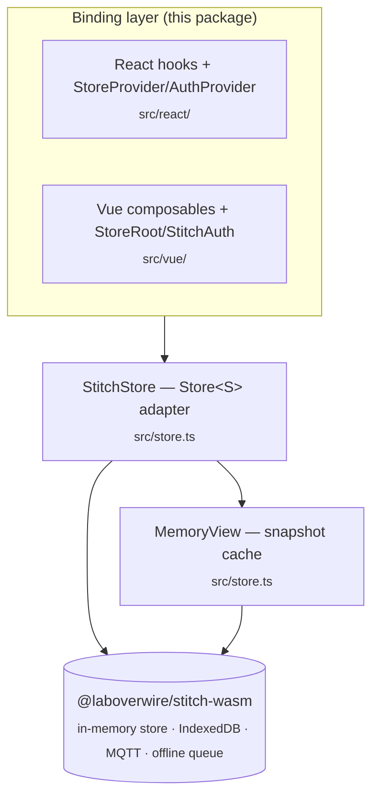

# Architecture

This document describes the internal design of `@laboverwire/stitch` — what this
package is, where the seam between it and the WASM engine sits, and the few
responsibilities the TypeScript layer actually owns.

For the public API surface, see [README.md](./README.md) and
[docs/api.md](./docs/api.md). For a history of changes, see
[CHANGELOG.md](./CHANGELOG.md).

---

## What the library is

As of 0.5.0, `@laboverwire/stitch` is a **thin, framework-agnostic binding
layer** over [`@laboverwire/stitch-wasm`](https://www.npmjs.com/package/@laboverwire/stitch-wasm)
(`^0.2.1`) — a Rust/WASM package compiled from the sibling `stitch-rs` repo. The
WASM package owns everything that used to live here:

1. **Synchronous reads for the UI** — an in-memory store services `read` /
   `getSnapshot` without awaiting.
2. **Durable local state** — IndexedDB persistence (optionally AES-GCM encrypted).
3. **Live multi-device sync** — MQTT v5 over WebSocket, with reconcile.
4. **Offline tolerance** — a durable offline queue that drains on reconnect.

This package contributes two things and nothing else:

- a small TypeScript adapter (`src/store.ts`) that wraps the WASM `Store` behind
  a stable `Store<S>` interface, normalizes a few types, and tolerates access
  before `initialize()` resolves;
- React (`@laboverwire/stitch/react`) and Vue (`@laboverwire/stitch/vue`)
  bindings that subscribe to scoped entities.

**There is no store logic in this repo.** No memory store, persistence layer,
sync engine, remote-sync layer, or offline queue — those files were removed in
0.5.0 and their behaviour now lives in `stitch-wasm`. If a bug concerns
persistence, MQTT sync, the offline queue, reconciliation, corruption recovery,
or topic parsing, it is in `stitch-rs`, not here.

---

## The seam



`createStore(config, options)` — the only value export from the package root —
calls the WASM `createStore(config, options)` and wraps the result in
`StitchStore`. Everything else the root exports is a **type**: `StoreConfig`,
`EntityDefinition`, `SchemaField`, `ForeignKeyDefinition`, `ConnectionStatus`,
`SortField`, `SortDirection`, `ListFilter`, `Store`, `StoreOptions`,
`PersistenceConfig`, `RemoteConfig`, `MemoryStore`, `EntitySchema`,
`DefaultSchema`, `EntityKey`, `OriginTag`.

---

## Module map

| File | Role |
|---|---|
| `src/types.ts` | Public type exports — `Store`, `StoreConfig`, `StoreOptions`, the schema-generic helpers, and the trimmed `MemoryStore` view interface. |
| `src/store.ts` | `StitchStore` (the `Store<S>` adapter) and `MemoryView` (the snapshot cache). `createStore()` lives here. |
| `src/index.ts` | Package root: re-exports `createStore` and the public types. |
| `src/internal-list-apply.ts` | `applyEvent` — the pure list-diff helper the hooks use to fold subscription events into a rendered list. |
| `src/react/` | React bindings — `context.ts`, `provider.tsx`, `hooks/*`. |
| `src/vue/` | Vue 3 bindings — `injection-key.ts`, `StoreRoot.ts`, `StitchAuth.ts`, `composables/*`. |

---

## What the adapter owns

`StitchStore<S>` forwards nearly every call straight to the WASM store. It adds
four responsibilities, and only these:

### 1. Pre-init tolerance

The WASM store requires `initialize()` before use and throws otherwise. The
adapter never lets that throw reach a caller, so React/Vue hooks are safe to
mount before the provider's `initialize()` resolves:

- **Synchronous reads return empties** before init: `read` → `null`,
  `getSnapshot` → `[]`, `getSnapshotAsMap` → `{}`, `getChildCount` / `getVersion`
  → `0`, `connectionStatus` → `'offline'`, `isReconnecting` → `false`.
- **Async methods await readiness** — `#afterReady(fn)` runs `fn` immediately if
  ready, otherwise chains it onto an internal `#readyPromise` that
  `initialize()` resolves.
- **`subscribe*` defer wiring** via `deferrableSubscribe(isReady, whenReady,
  subscribeNow, poke)`: if the store is ready it subscribes immediately;
  otherwise it waits on the ready promise, subscribes on resolution, and calls
  `poke` so `useSyncExternalStore`-style consumers re-read the now-available
  state. The returned unsubscribe cancels either the pending wire or the live
  subscription.

### 2. Status normalization

`normalizeStatus` maps the WASM store's PascalCase status (`Connected`,
`Connecting`, `Disconnected`, `Error`) onto the lowercase `ConnectionStatus`
union, defaulting anything else to `'offline'`. Consumers always see lowercase.

### 3. Reconnect signature preservation

`reconnect(serverUrl, getTicket?)` runs any registered reconnect validator,
resolves the ticket via `getTicket`, and forwards to
`inner.reconnect(serverUrl, ticket)`. The WASM API takes a resolved ticket
string; the adapter keeps the `() => Promise<string>` shape the bindings expect.

### 4. Capability flags

`hasPersistence` / `hasRemote` are derived once in the constructor from whether
`options.persistence` / `options.remote` were provided, so they are readable
before init without touching the WASM store.

### MemoryView — the snapshot cache

`MemoryView` implements the trimmed `MemoryStore` interface (`getSnapshot`,
`getSnapshotAsMap`, `subscribeToScope`). It keeps a per-`(scopeId, entity)` cache
keyed on the WASM store's reactivity token: `getVersion(scopeId, entity)` returns
a numeric version, and a cached snapshot is returned verbatim until that version
changes. This referential stability is what lets `useSyncExternalStore` avoid
re-render loops. Before the store is `ready()`, snapshots return the shared
`EMPTY_ARRAY` / `EMPTY_MAP` constants.

---

## Behavioural contracts the bindings depend on

- **Event delivery is asynchronous.** `subscribeToEntity` / `subscribeToScope`
  callbacks fire one tick after the mutating call resolves, not synchronously.
  Hooks and tests must await a tick before asserting on subscription output. The
  bindings treat a `subscribeToEntity` callback with `data === null` as a
  "bulk-refresh, re-fetch" cue.
- **`getVersion` is an opaque reactivity token**, not a count — it exists only to
  invalidate `MemoryView`'s cache. Treat it as monotonic-ish, not as a record
  count or a sequential revision.
- **`replaceScope` is destructive inside the WASM store** — it rebuilds the
  in-memory scope. Consumers holding references to pre-replace records must
  re-read after the promise resolves; the hook layer re-subscribes automatically.
- **Pre-init reads are silent empties, not errors.** A `getSnapshot` returning
  `[]` before `initialize()` resolves is expected, not a data-loss bug.

---

## Scope model

Configured via `StoreConfig.scope`:

- `rootEntity` — the top-level entity type; its `id` **is** the `scopeId`.
- `childEntities` — entity types scoped under the root via `scopeField`.
- `scopeField` — the field on children that references the root's `id`.

Entity categories: **root** (scoped parent), **child** (scoped via `scopeField`),
**top-level** (`topLevelEntities`, synced globally), **local-only**
(`localOnlyEntities`, never touch MQTT). Scope open/close, reconciliation,
offline-queue consolidation, `_version` LWW conflict resolution, and the MQTT
topic layout are all implemented in `stitch-wasm`; this package only forwards
`replaceScope` / `closeScope` / `loadScope` / `clearScope`.

`StoreConfig.responseTopicPrefix` (default `$DB/clients`) is still a config field
and is forwarded to the WASM store, but the response-topic parsing lives in the
WASM, not here.

---

## Binding layer

Both framework layers consume the same `Store` interface and add no store logic:

- **React** (`src/react/`) — `StoreProvider` owns the store lifecycle
  (`initialize`, connection-status tracking, visibility-change reconnect,
  `beforeunload` disconnect); `AuthProvider` binds `setAuthenticatedUser` /
  session-invalid / reconnect-validator handlers and tears down via
  `resetForLogout` on logout. Hooks: `useEntitySnapshot`,
  `useEntitySnapshotAsMap`, `useScopedEntities`, `useRootEntityList`,
  `useTopLevelEntities`, `useChildCounts`, `useConnectionStatus`, `useSyncScope`,
  `useStore`.
- **Vue** (`src/vue/`) — `StoreRoot` and `StitchAuth` mirror the two React
  providers; the composables mirror the hooks.

`useEntitySnapshot` reads through `store.memory` (the `MemoryView`) with
`useSyncExternalStore`; the version-keyed cache is what keeps its snapshot
referentially stable across renders. The list hooks
(`useScopedEntities` / `useRootEntityList` / `useTopLevelEntities` /
`useChildCounts`) fetch via `store.list` / `store.listRootEntities` and fold
subsequent `subscribeToEntity` events in with `applyEvent`.

Because the adapter tolerates pre-init access, these hooks are safe to mount
before the provider finishes initializing — a subscription established early
wires up and re-reads once `initialize()` resolves.

---

## Testing

Tests run in real Chromium via Playwright + Vitest browser mode — jsdom /
happy-dom do not work because the WASM layer needs a real `window`, real
IndexedDB, and a real `application/wasm` response. `vitest.config.ts` loads the
WASM through `vite-plugin-wasm` + `vite-plugin-top-level-await` (the same two
plugins a consuming Vite app needs — see
[docs/vite-consumer.md](./docs/vite-consumer.md)).

```bash
npm test               # one-shot, real Chromium
npm run test:watch     # watch mode
```

Tests live in `tests/integration/` (cross-cutting behaviour through the adapter,
including the React/Vue init-ordering coverage) and `tests/unit/` (isolated
primitives like `applyEvent` and schema-type inference via `expectTypeOf`).
Fixtures in `tests/helpers/` provide `projectTaskConfig()` and a `uniqueDbName()`
for test isolation.

---

## Where the engine internals live

Everything below the seam — the dual in-memory/IndexedDB stores, MQTT v5
enhanced-auth, request/response correlation, the offline queue and its
consolidation, reconciliation and `_version` LWW, corruption recovery, and the
`$DB/…` topic tree — is implemented in `stitch-wasm` (the `stitch-rs` repo). See
that repo's `ARCHITECTURE.md` for the engine design.
